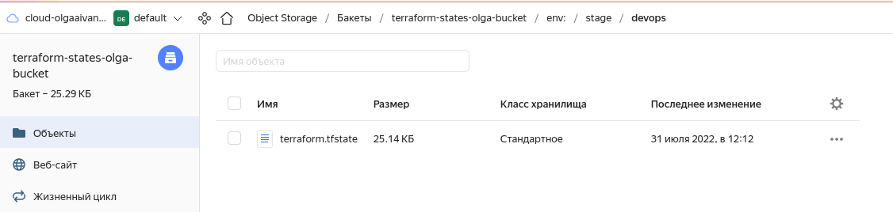
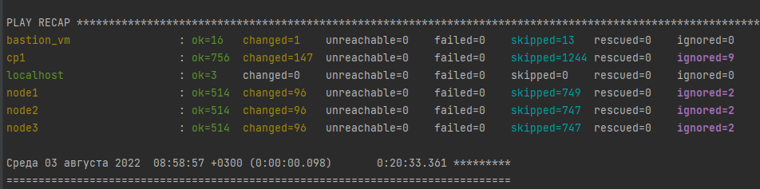
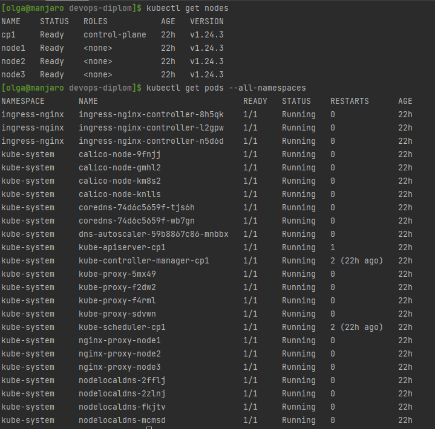

# Создание облачной инфраструктуры

## Подготовительные действия для Terraform

- Установлен terraform. [Документация](https://cloud.yandex.ru/docs/tutorials/infrastructure-management/terraform-quickstart)
- Отредактирован файл `nano ~/.terraformrc`:
```bash
provider_installation {
  network_mirror {
    url = "https://terraform-mirror.yandexcloud.net/"
    include = ["registry.terraform.io/*/*"]
  }
  direct {
    exclude = ["registry.terraform.io/*/*"]
  }
}
```
- Созданы директории [bucket](terraform/bucket) и [infrastructure](terraform/infrastructure)
- В них добавлены файлы .gitignore
- Получен OAuth-token [ссылка](https://cloud.yandex.ru/docs/iam/concepts/authorization/oauth-token)
- Получен id облака (cloud_id) [ссылка](https://console.cloud.yandex.ru/cloud)
- Получен id каталога (folder_id): облако -> подпапка (default) -> id из url [ссылка](https://console.cloud.yandex.ru/folders/b1gcefcbnh0ok32bkvif)
- Выбрана зона доступности по умолчанию (zone)

### [bucket](terraform/bucket)
[Документация](https://cloud.yandex.ru/docs/tutorials/infrastructure-management/terraform-state-storage)  
Отдельно с помощью Terraform создан бакет, в который будут загружаться состояния.  
- Созданы конфигурационные файлы `main.tf` и `versions.tf` с блоками `terraform` и `provider`
- В консоли выполнена установка переменной окружения с токеном `export YC_TOKEN=...`
- Запущен `terraform init` для инициализации провайдеров
- Создан сервисный аккаунт с ролью `editor` на каталог, статический ключ доступа и сам бакет.
- В `output` выгружены ключи. Секретный ключ записан в файл `terraform.tfstate`

### [infrastructure](terraform/infrastructure)
- Созданы конфигурационные файлы `main.tf` и `versions.tf` с блоками `terraform` и `provider`
- В консоли выполнена установка переменных окружения: токен `export YC_TOKEN=...`, id ключа `export YC_ACCESS_KEY_ID=...`, секретный ключ `export YC_SECRET_ACCESS_KEY=...`
  (ключи получены на прошлом этапе)
- Создан конфигурационный файл `backend.tf` с информацией о `backend` (бакет, который создали ранее)
- Для инициализации провайдеров и бекенда выполнено:
```bash
[olga@manjaro infrastructure]$ terraform init -backend-config "access_key=$YC_ACCESS_KEY_ID" -backend-config "secret_key=$YC_SECRET_ACCESS_KEY"
```
- Созданы workspace:
```bash
[olga@manjaro infrastructure]$ terraform workspace new stage
[olga@manjaro infrastructure]$ terraform workspace new prod
[olga@manjaro infrastructure]$ terraform workspace select stage
[olga@manjaro infrastructure]$ terraform workspace list
  default
  prod
* stage
```
- Создана VPC с одной публичной подсетью, NAT-инстансом и таблицей маршрутизации, приватными подсетями в разных зонах доступности. 
Трафик из приватных подсетей направляется в NAT-инстанс. См. [infrastructure](terraform/infrastructure)
- Выполнен `terraform apply`
- Файл с состояниями появился в бакете:  


# Создание Kubernetes кластера

Kubernetes кластер развёрнут с помощью kubespray в приватных подсетях.  
Для этого (на примере `stage`):
- созданы виртуальные машины в приватных подсетях. Настройки master и worker нод различные. На все ВМ проброшен ssh-ключ.
При указании настроек ориентировалась на [15-install](https://github.com/aak74/kubernetes-for-beginners/blob/308a72d08cf3aa62984211f793d3f9d24dd90ced/15-install/README.md)
- создана виртуальная машина бастион в публичной подсети. Она будет использоваться для доступа к кластеру.
По бастиону использовала [документацию ansible](https://docs.ansible.com/ansible/latest/reference_appendices/faq.html#how-do-i-configure-a-jump-host-to-access-servers-that-i-have-no-direct-access-to)
- на все ВМ выполнен вход через ssh, чтобы сохранилась информация в known hosts. На приватные ВМ выполнен вход через бастион. Например:
```bash
[olga@manjaro ~]$ ssh ubuntu@62.84.114.91 -i ~/.ssh/id_rsa_ya
[olga@manjaro ~]$ ssh -o ProxyCommand='ssh -W %h:%p -q ubuntu@62.84.114.91 -i ~/.ssh/id_rsa_ya' ubuntu@192.168.10.13 -i ~/.ssh/id_rsa_ya
[olga@manjaro ~]$ ssh -o ProxyCommand='ssh -W %h:%p -q ubuntu@62.84.114.91 -i ~/.ssh/id_rsa_ya' ubuntu@192.168.20.18 -i ~/.ssh/id_rsa_ya
[olga@manjaro ~]$ ssh -o ProxyCommand='ssh -W %h:%p -q ubuntu@62.84.114.91 -i ~/.ssh/id_rsa_ya' ubuntu@192.168.30.8 -i ~/.ssh/id_rsa_ya
```
- Склонирован репозиторий `https://github.com/kubernetes-sigs/kubespray`, создано виртуальное окружение, установлены зависимости,
  созданы новые `inventory` (для stage и prod), сгенерирован `hosts.yml` сначала со случайными адресами (редактирование впоследствии осуществлено вручную.)
```bash
[olga@manjaro devops]$ git clone https://github.com/kubernetes-sigs/kubespray.git
[olga@manjaro devops]$ cd ./kubespray
[olga@manjaro kubespray]$ python3 -m venv venv_kuber
[olga@manjaro kubespray]$ . venv_kuber/bin/activate
(venv_kuber) [olga@manjaro kubespray]$ pip3 install -r requirements.txt
(venv_kuber) [olga@manjaro kubespray]$ cp -rfp inventory/sample inventory/diplom-stage
(venv_kuber) [olga@manjaro kubespray]$ declare -a IPS=(10.10.1.3 10.10.1.4 10.10.1.5)
(venv_kuber) [olga@manjaro kubespray]$ CONFIG_FILE=inventory/diplom-stage/hosts.yaml python3 contrib/inventory_builder/inventory.py ${IPS[@]}
```
- Выполнено редактирование [hosts.yaml](kubespray/inventory/diplom-stage/hosts.yaml) - добавлены пути к приватным ssh-ключам, ip-адреса, определено, что относится к `bastion`, `kube_control_plane`,`kube_node`, `etcd`
Для нод кластера указан дополнительный параметр `ansible_ssh_common_args`, который позволяет получить к ним доступ через бастион.
- Остальные файлы оставлены без изменений.
- Запуск kubespray:
```bash
(venv_kuber) [olga@manjaro kubespray]$ ansible-playbook -i inventory/diplom-stage/hosts.yaml  --become --become-user=root cluster.yml -vvv
```
- Результат:

- Конфиг взят с мастер-ноды:
```bash
[olga@manjaro ~]$ ssh -o ProxyCommand='ssh -W %h:%p -q ubuntu@62.84.114.91 -i ~/.ssh/id_rsa_ya' ubuntu@192.168.10.13 -i ~/.ssh/id_rsa_ya
ubuntu@cp1:~$ sudo su
root@cp1:/home/ubuntu# cat /etc/kubernetes/admin.conf
```
- Выполнен проброс портов через бастион, в конфиге заменён порт на 12345.
```bash
[olga@manjaro ~]$ ssh -L 12345:192.168.10.13:6443 ubuntu@62.84.114.91 -i ~/.ssh/id_rsa_ya
[olga@manjaro devops-diplom]$ kubectl --kubeconfig=./kubespray/kube-config get nodes
NAME    STATUS   ROLES           AGE   VERSION
cp1     Ready    control-plane   31m   v1.24.3
node1   Ready    <none>          29m   v1.24.3
node2   Ready    <none>          29m   v1.24.3
```
- Итоговый [конфиг](kubespray/kube-config) для `stage`
- Создан неймспейс
```bash
[olga@manjaro devops-diplom]$ kubectl --kubeconfig=./kubespray/kube-config create namespace stage
namespace/stage created
```


# Создание тестового приложения
```bash
[olga@manjaro app]$ docker build -t anguisa/diplom_app -f Dockerfile .
[olga@manjaro app]$ docker login -u anguisa
[olga@manjaro app]$ docker push anguisa/diplom_app:latest
[olga@manjaro devops-diplom]$ kubectl --kubeconfig=./kubespray/kube-config apply -f app/deployment.yml -n stage
deployment.apps/diplom created
service/diplom created
```
[Образ](https://hub.docker.com/repository/docker/anguisa/diplom_app)  
[Приложение](https://github.com/anguisa/devops-diplom-app)