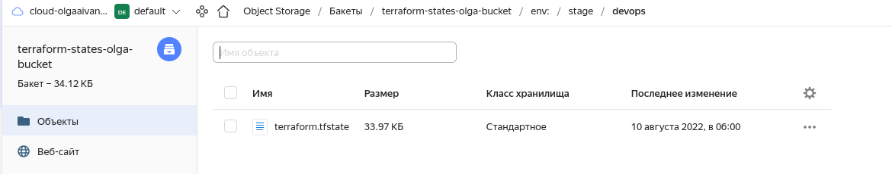

# Создание облачной инфраструктуры

Репозиторий - [https://github.com/anguisa/devops-diplom-terraform](https://github.com/anguisa/devops-diplom-terraform)

## Подготовительные действия для Terraform

- Установлен terraform. [Документация](https://cloud.yandex.ru/docs/tutorials/infrastructure-management/terraform-quickstart)
- Отредактирован файл `nano ~/.terraformrc`:
```bash
provider_installation {
  network_mirror {
    url = "https://terraform-mirror.yandexcloud.net/"
    include = ["registry.terraform.io/*/*"]
  }
  direct {
    exclude = ["registry.terraform.io/*/*"]
  }
}
```
- Созданы директории [bucket](https://github.com/anguisa/devops-diplom-terraform/tree/main/bucket) и [infrastructure](https://github.com/anguisa/devops-diplom-terraform/tree/main/infrastructure)
- В них добавлены файлы .gitignore
- Получен OAuth-token по [ссылке](https://cloud.yandex.ru/docs/iam/concepts/authorization/oauth-token)
- Получен id облака (cloud_id) по [ссылке](https://console.cloud.yandex.ru/cloud)
- Получен id каталога (folder_id): облако -> подпапка (default) -> id из url по [ссылке](https://console.cloud.yandex.ru/folders/b1gcefcbnh0ok32bkvif)
- Выбрана зона доступности по умолчанию (zone)

### [bucket](https://github.com/anguisa/devops-diplom-terraform/tree/main/bucket)  
[Документация](https://cloud.yandex.ru/docs/tutorials/infrastructure-management/terraform-state-storage)  
Отдельно с помощью Terraform создан бакет, в который будут загружаться состояния.  
- Созданы конфигурационные файлы `main.tf` и `versions.tf` с блоками `terraform` и `provider`
- В консоли выполнена установка переменной окружения с токеном `export YC_TOKEN=...`
- Запущен `terraform init` для инициализации провайдеров
- Создан сервисный аккаунт с ролью `editor` на каталог, статический ключ доступа и сам бакет.
- В `output` выгружены ключи. Секретный ключ записан в файл `terraform.tfstate`
- Выполнен `terraform apply` для применения изменений.

### [infrastructure](https://github.com/anguisa/devops-diplom-terraform/tree/main/infrastructure)
- Созданы конфигурационные файлы `main.tf` и `versions.tf` с блоками `terraform` и `provider`
- В консоли выполнена установка переменных окружения: токен `export YC_TOKEN=...`, id ключа `export YC_ACCESS_KEY_ID=...`, секретный ключ `export YC_SECRET_ACCESS_KEY=...`
  (ключи получены на прошлом этапе)
- Создан конфигурационный файл `backend.tf` с информацией о `backend` (бакет, который создали ранее)
- Для инициализации провайдеров и бекенда выполнено:
```bash
[olga@manjaro infrastructure]$ terraform init -backend-config "access_key=$YC_ACCESS_KEY_ID" -backend-config "secret_key=$YC_SECRET_ACCESS_KEY"
```
- Созданы workspace:
```bash
[olga@manjaro infrastructure]$ terraform workspace new stage
[olga@manjaro infrastructure]$ terraform workspace new prod
[olga@manjaro infrastructure]$ terraform workspace select stage
[olga@manjaro infrastructure]$ terraform workspace list
  default
  prod
* stage
```
- Создана VPC с одной публичной подсетью, NAT-инстансом и таблицей маршрутизации, приватными подсетями в разных зонах доступности. 
Трафик из приватных подсетей направляется в NAT-инстанс. 
- Выполнен `terraform apply`
- Файл с состояниями появился в бакете:
  
- Итоговые ВМ:
  

# Создание Kubernetes кластера

Репозиторий с конфигурациями ansible - [https://github.com/anguisa/devops-diplom-kubespray](https://github.com/anguisa/devops-diplom-kubespray)  

Kubernetes кластер развёрнут с помощью kubespray в приватных подсетях.  
Для этого (на примере `stage`):  
- Созданы виртуальные машины в приватных подсетях. Настройки master и worker нод различные. На все ВМ проброшен ssh-ключ.
При указании настроек ориентировалась на [15-install](https://github.com/aak74/kubernetes-for-beginners/blob/308a72d08cf3aa62984211f793d3f9d24dd90ced/15-install/README.md)
- Создана виртуальная машина бастион в публичной подсети. Она будет использоваться для доступа к кластеру.
По бастиону использовала [документацию ansible](https://docs.ansible.com/ansible/latest/reference_appendices/faq.html#how-do-i-configure-a-jump-host-to-access-servers-that-i-have-no-direct-access-to)
- На все ВМ выполнен вход через ssh, чтобы сохранилась информация в known hosts. На приватные ВМ выполнен вход через бастион. Например:
```bash
[olga@manjaro ~]$ ssh ubuntu@84.201.134.130 -i ~/.ssh/id_rsa_ya
[olga@manjaro ~]$ ssh -o ProxyCommand='ssh -W %h:%p -q ubuntu@84.201.134.130 -i ~/.ssh/id_rsa_ya' ubuntu@192.168.10.26 -i ~/.ssh/id_rsa_ya
[olga@manjaro ~]$ ssh -o ProxyCommand='ssh -W %h:%p -q ubuntu@84.201.134.130 -i ~/.ssh/id_rsa_ya' ubuntu@192.168.20.27 -i ~/.ssh/id_rsa_ya
[olga@manjaro ~]$ ssh -o ProxyCommand='ssh -W %h:%p -q ubuntu@84.201.134.130 -i ~/.ssh/id_rsa_ya' ubuntu@192.168.30.12 -i ~/.ssh/id_rsa_ya
[olga@manjaro ~]$ ssh -o ProxyCommand='ssh -W %h:%p -q ubuntu@84.201.134.130 -i ~/.ssh/id_rsa_ya' ubuntu@192.168.40.16 -i ~/.ssh/id_rsa_ya
```
- Склонирован репозиторий `https://github.com/kubernetes-sigs/kubespray`, создано виртуальное окружение, установлены зависимости,
  созданы новые `inventory` (для stage и prod), сгенерирован `hosts.yml` сначала со случайными адресами (редактирование впоследствии осуществлено вручную)
```bash
[olga@manjaro devops]$ git clone https://github.com/kubernetes-sigs/kubespray.git
[olga@manjaro devops]$ cd ./kubespray
[olga@manjaro kubespray]$ python3 -m venv venv_kuber
[olga@manjaro kubespray]$ . venv_kuber/bin/activate
(venv_kuber) [olga@manjaro kubespray]$ pip3 install -r requirements.txt
(venv_kuber) [olga@manjaro kubespray]$ cp -rfp inventory/sample inventory/diplom-stage
(venv_kuber) [olga@manjaro kubespray]$ declare -a IPS=(10.10.1.3 10.10.1.4 10.10.1.5)
(venv_kuber) [olga@manjaro kubespray]$ CONFIG_FILE=inventory/diplom-stage/hosts.yaml python3 contrib/inventory_builder/inventory.py ${IPS[@]}
```
- Выполнено редактирование [hosts.yaml](https://github.com/anguisa/devops-diplom-kubespray/tree/main/inventory/diplom-stage/hosts.yaml) - добавлены пути к приватным ssh-ключам, ip-адреса, определено, что относится к `bastion`, `kube_control_plane`, `kube_node`, `etcd`
Для нод кластера указан дополнительный параметр `ansible_ssh_common_args`, который позволяет получить к ним доступ через бастион.
- Также отредактирован файл [k8s_cluster/addons.yaml](https://github.com/anguisa/devops-diplom-kubespray/tree/main/inventory/diplom-stage/group_vars/k8s_cluster/addons.yml) - включён nginx ingress контроллер (`ingress_nginx_enabled: true`)
- Остальные файлы оставлены без изменений.
- Запуск kubespray:
```bash
(venv_kuber) [olga@manjaro kubespray]$ ansible-playbook -i inventory/diplom-stage/hosts.yaml  --become --become-user=root cluster.yml -vvv
```
Если сначала установить без nginx ingress контроллера, то впоследствии можно поправить конфигурацию и запустить только необходимые теги: 
`ansible-playbook -i inventory/diplom-stage/hosts.yaml  --become --become-user=root cluster.yml -vvv --tags apps,ingress-nginx,ingress-controller`
- Результат:

- Конфиг взят с мастер-ноды:
```bash
[olga@manjaro ~]$ ssh -o ProxyCommand='ssh -W %h:%p -q ubuntu@84.201.134.130 -i ~/.ssh/id_rsa_ya' ubuntu@192.168.10.26 -i ~/.ssh/id_rsa_ya
ubuntu@cp1:~$ sudo su
root@cp1:/home/ubuntu# cat /etc/kubernetes/admin.conf
```
- Выполнен проброс портов через бастион, в конфиге заменён порт 6443 на 12345.
```bash
[olga@manjaro ~]$ ssh -fNT -L 12345:192.168.10.26:6443 ubuntu@84.201.134.130 -i ~/.ssh/id_rsa_ya
[olga@manjaro devops-diplom]$ kubectl get nodes
NAME    STATUS   ROLES           AGE   VERSION
cp1     Ready    control-plane   22h   v1.24.3
node1   Ready    <none>          22h   v1.24.3
node2   Ready    <none>          22h   v1.24.3
node3   Ready    <none>          22h   v1.24.3
```
- Итоговый [конфиг](kube-config) для `stage`
- Создан неймспейс
```bash
[olga@manjaro devops-diplom]$ kubectl create namespace stage
namespace/stage created
```
  
- Проверка неймспейса `ingress-nginx`:  
  
- Проверка `kubectl get pods --all-namespaces`:
  

# Создание тестового приложения

Репозиторий с приложением - [https://github.com/anguisa/devops-diplom-app](https://github.com/anguisa/devops-diplom-app)  
[Образ](https://hub.docker.com/r/anguisa/diplom_app/tags)

Первый образ собран и залит в репозиторий вручную.  

```bash
[olga@manjaro app]$ docker build -t anguisa/diplom_app -f Dockerfile .
[olga@manjaro app]$ docker login -u anguisa
[olga@manjaro app]$ docker push anguisa/diplom_app:latest
```

# Подготовка cистемы мониторинга и деплой приложения

Репозиторий для настройки kubernetes - [https://github.com/anguisa/devops-diplom-k8s](https://github.com/anguisa/devops-diplom-k8s)  
Настройки kube-prometheus - [https://github.com/anguisa/devops-diplom-k8s/tree/main/monitoring](https://github.com/anguisa/devops-diplom-k8s/tree/main/monitoring)  
Настройки приложения - [https://github.com/anguisa/devops-diplom-k8s/tree/main/diplom-app](https://github.com/anguisa/devops-diplom-k8s/tree/main/diplom-app)  
Настройки atlantis - [https://github.com/anguisa/devops-diplom-k8s/tree/main/atlantis](https://github.com/anguisa/devops-diplom-k8s/tree/main/atlantis)  
Url графаны - [http://158.160.6.221:8000/grafana](http://158.160.6.221:8000/grafana), логин/пароль - admin/admin12345  
Url тестового приложения - [http://158.160.6.221:8000/app](http://158.160.6.221:8000/app)  
PR с комментариями atlantis - [https://github.com/anguisa/devops-diplom-terraform/pull/13](https://github.com/anguisa/devops-diplom-terraform/pull/13)  
Дашборды графаны:
- [k8s-cluster-metrics](http://158.160.6.221:8000/grafana/d/taQlRuxik/k8s-cluster-metrics?orgId=1&refresh=1m)
- [kubernetes-views-pods](http://158.160.6.221:8000/grafana/d/k8s_views_pods/kubernetes-views-pods?orgId=1&refresh=30s&var-datasource=prometheus&var-namespace=stage&var-pod=atlantis-0&var-resolution=30s)

## Деплой kube-prometheus   

Репозиторий - [https://github.com/anguisa/devops-diplom-k8s](https://github.com/anguisa/devops-diplom-k8s)

Использованная документация:

- [Run Grafana behind a reverse proxy](https://grafana.com/tutorials/run-grafana-behind-a-proxy/)
- [Network Policies in kube-prometheus](https://github.com/prometheus-operator/kube-prometheus/issues/1719#issuecomment-1201654214)
- [Customizing Kube-Prometheus](https://github.com/prometheus-operator/kube-prometheus/blob/545d9ed089d040219b845dfdb906c0bc1314cccf/docs/customizing.md)
- [Ingress examples](https://github.com/prometheus-operator/kube-prometheus/blob/4e43a1e16e3b064e2fad6ac48922674340099f53/examples/ingress.jsonnet)

Шаги:  
- Установлен `go`
- Установлены `jb`, `gojsontoyaml`, `jsonnet`
```bash
[olga@manjaro devops]$ go install -a github.com/jsonnet-bundler/jsonnet-bundler/cmd/jb@latest
[olga@manjaro devops]$ go install github.com/brancz/gojsontoyaml@latest
[olga@manjaro devops]$ go install github.com/google/go-jsonnet/cmd/jsonnet@latest
```
- Выполнена установка:
```bash
[olga@manjaro devops-diplom-k8s]$ mkdir monitoring
[olga@manjaro devops-diplom-k8s]$ cd monitoring
[olga@manjaro monitoring]$ jb init # Creates the initial/empty `jsonnetfile.json`
# Install the kube-prometheus dependency
[olga@manjaro monitoring]$ jb install github.com/prometheus-operator/kube-prometheus/jsonnet/kube-prometheus@main # Creates `vendor/` & `jsonnetfile.lock.json`, and fills in `jsonnetfile.json`
[olga@manjaro monitoring]$ wget https://raw.githubusercontent.com/prometheus-operator/kube-prometheus/main/example.jsonnet -O example.jsonnet
[olga@manjaro monitoring]$ wget https://raw.githubusercontent.com/prometheus-operator/kube-prometheus/main/build.sh -O build.sh
```
- Внесены правки в `example.jsonnet`. Скорректированы NetworkPolicy, чтобы можно было получить доступ к сервисам из неймспейса `ingress-nginx`.
  В конфиг графаны добавлено `server: { serve_from_sub_path: true, root_url: 'http://localhost:3000/grafana' }`, чтобы она работала через ingress
  (иначе не работало перенаправление на login и остальные страницы).
  Также добавлена генерация ingress для графаны.
- Выполнено:
```bash
[olga@manjaro monitoring]$ bash ./build.sh example.jsonnet # Генерация файлов в manifests
[olga@manjaro monitoring]$ kubectl apply --server-side -f manifests/setup
[olga@manjaro monitoring]$ kubectl apply -f manifests/
```
(удаление возможно с помощью `kubectl delete --ignore-not-found=true -f manifests/ -f manifests/setup`)
- Сгенерированные `yaml` файлы для графаны с правками можно посмотреть в [grafana-config.yaml](https://github.com/anguisa/devops-diplom-k8s/blob/main/monitoring/manifests/grafana-config.yaml) 
и [grafana-ingress.yaml](https://github.com/anguisa/devops-diplom-k8s/blob/main/monitoring/manifests/grafana-ingress.yaml)

  

## Деплой тестового приложения
- Установлен qbec:
```bash
[olga@manjaro Downloads]$ wget https://github.com/splunk/qbec/releases/download/v0.15.2/qbec-linux-amd64.tar.gz 
[olga@manjaro Downloads]$ tar xf qbec-linux-amd64.tar.gz
[olga@manjaro Downloads]$ sudo mv ./qbec /usr/local/bin/
```
- Для преобразования yaml в jsonnet использован ресурс [https://jsonnet.org/articles/kubernetes.html](https://jsonnet.org/articles/kubernetes.html).
- Создание конфигурации:
```bash
# Создание конфигурации
[olga@manjaro devops-diplom-k8s]$ qbec init diplom-app --with-example
using server URL "https://127.0.0.1:12345" and default namespace "default" for the default environment
wrote diplom-app/params.libsonnet
wrote diplom-app/environments/base.libsonnet
wrote diplom-app/environments/default.libsonnet
wrote diplom-app/components/hello.jsonnet
wrote diplom-app/qbec.yaml
[olga@manjaro devops-diplom-k8s]$ cd diplom-app
# Просмотр итоговых шаблонов (после заполнения всех данных)
[olga@manjaro diplom-app]$ mkdir manifests
[olga@manjaro diplom-app]$ qbec show stage > manifests/stage.yaml
3 components evaluated in 5ms
[olga@manjaro diplom-app]$ qbec show prod > manifests/prod.yaml
3 components evaluated in 6ms
# Деплой
[olga@manjaro diplom-app]$ qbec apply stage --wait-all --yes
```

На первом этапе создаётся `deployment` для деплоя самого приложения, сервис типа ClusterIP и ингресс, задающий соответствие пути `/app` созданному сервису.

Сгенерированные манифесты - [manifests](https://github.com/anguisa/devops-diplom-k8s/tree/main/diplom-app/manifests)   
Настройки для qbec - [diplom-app](https://github.com/anguisa/devops-diplom-k8s/tree/main/diplom-app)  


## Создание балансировщика для доступа к графане и приложению

- В terraform [lb.tf](https://github.com/anguisa/devops-diplom-terraform/blob/main/infrastructure/lb.tf) добавлен сетевой балансировщик.  
  Для этого создана целевая группа с воркер-нодами, добавлен Network load balancer с двумя слушателями -
  на 8000 и 443 порту (направляет трафик на порты 80 и 443 ингресса соответственно).  
  В качестве healthcheck использован /healthz у ingress-nginx-controller (порт 10254). Для этого выполнено:
```bash
[olga@manjaro devops-diplom]$ kubectl get daemonset.apps/ingress-nginx-controller -n ingress-nginx -o yaml
```
И там найден вот такой блок:
```yaml
          httpGet:
            path: /healthz
            port: 10254
            scheme: HTTP
```

Итог: приложение доступно по адресу [http://158.160.6.221:8000/app](http://158.160.6.221:8000/app), графана - [http://158.160.6.221:8000/grafana](http://158.160.6.221:8000/grafana)  (admin/admin12345)


## Деплой atlantis для отслеживания инфраструктуры

Использованная документация:
- [Atlantis Installation Guide](https://www.runatlantis.io/docs/installation-guide.html)
- [NFS](https://github.com/aak74/kubernetes-for-beginners/tree/197e7f9c654cafa84e852a03269029510372c354/20-concepts/30-storage/20-persistent-volume/40-dynamic-provisioning)

Шаги:  
- В качестве пользователя использован существующий (дополнительный не создавался)
- В гитхабе в Developer settings -> Personal access tokens сгенерирован токен доступа сроком на 30 дней с `repo scope`
- Сгенерирован webhook secret на [сайте](https://www.browserling.com/tools/random-string) длиной 50 символов
- Вручную создан секрет с токеном и webhook secret для github, а также секрет с данными для подключения к backend в yandex cloud:
```bash
[olga@manjaro devops-diplom-k8s]$ kubectl create secret generic atlantis-vcs --from-file=secrets/github/token --from-file=secrets/github/webhook-secret -n stage
[olga@manjaro devops-diplom-k8s]$ kubectl create secret generic atlantis-yc --from-file=secrets/yc/token --from-file=secrets/yc/access_key_id --from-file=secrets/yc/secret_access_key -n stage
```
- Установлен `nfs-server` через `helm`, а также на всех нодах установлен `nfs-common` (из-за ошибки `... you might need a /sbin/mount.<type> helper program`)
```bash
[olga@manjaro diplom-app]$ helm repo add stable https://charts.helm.sh/stable && helm repo update
[olga@manjaro diplom-app]$ helm install nfs-server stable/nfs-server-provisioner
ubuntu@node1:~$ sudo apt install nfs-common
ubuntu@node2:~$ sudo apt install nfs-common
ubuntu@node3:~$ sudo apt install nfs-common
```
- Создана `configmap` с данными ключа `ssh`: 
```bash
[olga@manjaro atlantis]$ kubectl create configmap atlantis-ssh --from-file=/home/olga/.ssh/id_rsa_ya.pub -n stage
```
- В новый [qbec манифест](https://github.com/anguisa/devops-diplom-k8s/tree/main/atlantis) добавлен atlantis (statefulset, service и ingress).  
В `volumeClaimTemplates` добавлено `storageClassName: 'nfs'`. Прописаны переменные окружения для подключения к yandex cloud `YC_TOKEN`, `YC_ACCESS_KEY_ID`, `YC_SECRET_ACCESS_KEY`,
переменная `ATLANTIS_REPO_CONFIG_JSON` с server-side конфигом, в котором разрешается перезаписывать workflow, а также заменены значения переменных для подключения к github. 
Добавлена генерация файла `/home/atlantis/.terraformrc` с конфигурацией провайдера yandex.
Примонтирована информация по ssh-ключу из configmap.
- Выполнено `qbec apply stage --wait-all --yes`
- Создан конфигурационный файл [atlantis.yaml](https://github.com/anguisa/devops-diplom-terraform/blob/main/atlantis.yaml)
- В проекте `devops-diplom-terraform` гитхаба добавлен webhook на адрес `http://158.160.6.221/atlantis/events` (с webhook secret, созданным ранее, и настройками `Pull request reviews`, `Pushes`, `Issue comments`, `Pull requests`)
- Сделан PR из отдельной ветки в main проекта `devops-diplom-terraform`
- План выполнен успешно:  
  
  
- Чтобы повторить план конкретного проекта, оставлен комментарий `atlantis plan -p diplom-stage`
- Для применения плана оставлен комментарий `atlantis apply -p diplom-stage`. При этом в atlantis.yaml установлено значение параметра `apply_requirements: [mergeable]`, 
чтобы не требовалось подтверждение ревьеров. После закрытия PR все планы и блокировки автоматически удалены.
  

Сгенерированные манифесты - [manifests](https://github.com/anguisa/devops-diplom-k8s/tree/main/atlantis/manifests)  

Содержимое неймспейса `stage`:  
  

## Дашборды grafana

Для мониторинга Kubernetes кластера в графану импортировано несколько готовых дашбордов.  
  
  
- [k8s-cluster-metrics](http://158.160.6.221:8000/grafana/d/taQlRuxik/k8s-cluster-metrics?orgId=1&refresh=1m)
- [kubernetes-views-pods](http://158.160.6.221:8000/grafana/d/k8s_views_pods/kubernetes-views-pods?orgId=1&refresh=30s&var-datasource=prometheus&var-namespace=stage&var-pod=atlantis-0&var-resolution=30s)

# Установка и настройка CI/CD

Настройки jenkins в kubernetes - [https://github.com/anguisa/devops-diplom-k8s/tree/main/jenkins](https://github.com/anguisa/devops-diplom-k8s/tree/main/jenkins)  
URL jenkins - [http://158.160.6.221:8000/jenkins](http://158.160.6.221:8000/jenkins), логин/пароль - admin/admin12345

Использованная документация:
- [Setup Jenkins On Kubernetes Cluster](https://devopscube.com/setup-jenkins-on-kubernetes-cluster/)

Шаги:
- Создан отдельный неймспейс `kubectl create namespace jenkins`
- В новый [qbec манифест](https://github.com/anguisa/devops-diplom-k8s/tree/main/jenkins) добавлен jenkins (deployment, service и ingress для сервера). 
Добавлен префикс для url в параметрах jenkins JENKINS_OPTS=`--prefix=/jenkins` (он же будет использоваться для ингресса). 
Создан volume `jenkins-server-disk`, сервисный аккаунт `jenkins-admin`, чтобы jenkins мог использовать поды kubernetes в качестве build-агентов, 
а также сервисный аккаунт `jenkins-agent`, чтобы агенты могли деплоить во все неймспейсы.
- Выполнено `qbec apply stage --wait-all --yes`
- В dockerhub сгенерирован Access Token, который будет использоваться в Jenkins.
- На основе него создан секрет:
```bash
kubectl create secret docker-registry docker-credentials \
--docker-username="anguisa"  \
--docker-password="..." -n jenkins
```
- Выполнен первый вход в jenkins, введён первоначальный пароль из файла внутри пода, установлены плагины по умолчанию (основные - 
Pipeline, Git, Github Branch Source), задан jenkins URL 
```bash
[olga@manjaro ~]$ kubectl exec -it jenkins-server-654679d85d-9d7n2 -n jenkins -- bash
jenkins@jenkins-server-654679d85d-9d7n2:/$ cat /var/jenkins_home/secrets/initialAdminPassword
```
- Дополнительно установлены плагины Kubernetes, Generic Webhook Trigger.
- Добавлена конфигурация для Kubernetes в `Configure Clouds` - т.к. сервер jenkins в том же самом кластере, 
достаточно в настройках указать только неймспейс `jenkins`, поставлена галочка у WebSocket. Теперь в качестве build-агентов jenkins будет создавать
поды в неймспейсе. Jenkins сервер перезапущен.
- Создан Pipeline с использованием Generic Webhook Trigger (параметры триггера заданы декларативно -> запущено вручную 1 раз, чтобы применилось). Алгоритм следующий:
  - В github создан webhook триггер на события Branch or tag creation, Pushes. В нём прописан адрес Jenkins с неким токеном. `http://158.160.6.221:8000/jenkins/generic-webhook-trigger/invoke?token=MYTOKEN`
  - В pipeline указан этот же токен, а также выполнен парсинг сообщения от github. Триггер будет срабатывать в том случае, если пришло событие создания тега
    или выполнен push какого-то коммита (у которого в id не все 0) в любую другую ветку, кроме тега (т.к. при создании тега приходит 2 события).
  - Выполняется checkout пришедшей ветки репозитория.
  - Определяется либо тег, либо краткий хеш коммита. Генерируется имя образа.
  - С помощью `kaniko` собирается и пушится docker-образ (сборка без docker) (в контейнере с `kaniko`).
  - Если изначально пришло событие создания тега, выполняется патч деплоймента с новым именем образа (в контейнере с `kubectl`).
- [Jenkinsfile](https://github.com/anguisa/devops-diplom-app/blob/main/Jenkinsfile) размещён в репозитории, однако 
в Jenkins он скопирован (т.к. используется обычный Pipeline).  
Плагины github с poll scm работают некорректно для тегов - срабатывают только в случае наличия новых коммитов.
- Из-за jenkins добавлены ресурсы к ВМ в кластере (RAM, vCPU, доля vCPU).

Сгенерированные манифесты - [manifests](https://github.com/anguisa/devops-diplom-k8s/tree/main/jenkins/manifests)

Содержимое неймспейса `jenkins`:  
  

Результаты работы Pipeline:  
Сборка коммита:  
  

Сборка тега:  
  